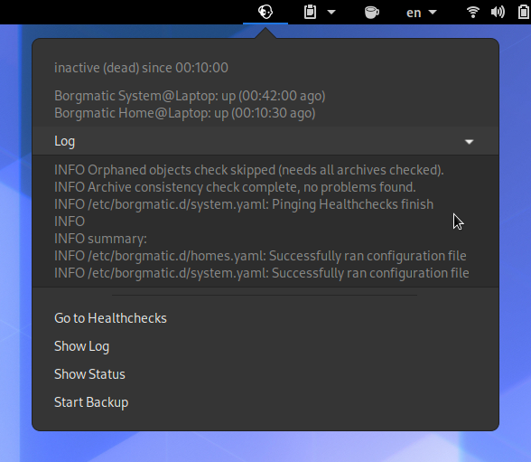

#  Borgmacator

Borgmacator is a GNOME AppIndicator for [Borgmatic](https://torsion.org/borgmatic/).

<p align="center">
  
</p>

The menu displays the status of the systemd service, the healthchecks and the most recent journal entries.
Additionally, there are some buttons for quickly accessing common actions.
If there are any healthchecks down, their number will show up next to the icon.
The topbar icon displays the following states:
<table>
  <tr><td></td><td>Done. Last run was successful and not too long ago.</td></tr>
  <tr><td></td><td>Running.</td></tr>
  <tr><td></td><td>Condition check (e.g AC Power) resulted in backup being skipped.</td></tr>
  <tr><td></td><td>Error. Last run was not successful.</td></tr>
  <tr><td></td><td>Starting. Sleeping for some time before starting the service.</td></tr>
</table>

### Installation

First, make sure that you have [PyGObject](https://pygobject.readthedocs.io/en/latest/getting_started.html#getting-started) ready and the [AppIndicator-support extension](https://extensions.gnome.org/extension/615/appindicator-support/) enabled.
Install the package directly from GitHub using pip, preferably into a [venv](https://docs.python.org/3/tutorial/venv.html):
```bash
python3 -m venv ~/.local/share/borgmacator/venv --system-site-packages
source ~/.local/share/borgmacator/venv/bin/activate
pip install git+https://github.com/N-Coder/borgmacator.git#egg=borgmacator
borgmacator-autostart
```
The `borgmacator-autostart` script will enable autostarting borgmacator when you login to your GNOME session by creating the file `~/.config/autostart/borgmactor.desktop`. Additionally, it will create a `~/.config/borgmacator.json` file with the following config, which you should modify to your needs:
```json
{
  "healthchecks": {"api_key": "TODO", "filter": []},
  "terminal": {"path": "gnome-terminal", "args": ["--"], "kwargs": {}},
  "log_lines": 10,
  "update_interval": 15
}
```
Note that the indicator currently won't work without an healthchecks API key configured.
If you don't want to relogin, you can start the indicator manually using the `borgmacator` command, or use `borgmacator-restart` to stop all running instances and start a new instance in the background (like running it via Alt+F2).

### Warning

This is alpha-level software. Expect it to contain bugs and not run on your setup.
I wrote this small script mostly to monitor my own backup, but thought it could also be useful to others. 
If you have any issues, have a look at the code and modify it to suit you needs (and maybe open a PR if you think your changes might be useful to others, too :wink:).

### License
Borgmacator, borgmatic and the borgmatic logo used are licensed under the GNU General Public License version 3 or any later version.
The icons are tinted version of the original logo by Dan Helfman (witten@torsion.org).

### Interesting links
- https://healthchecks.io/docs/api/
- https://gist.github.com/candidtim/5663cc76aa329b2ddfb5
- https://github.com/torfsen/python-systemd-tutorial
- https://lazka.github.io/pgi-docs
- https://developer.gnome.org/pygtk/stable/pango-markup-language.html
- https://github.com/facebookincubator/pystemd
- https://github.com/systemd/python-systemd
- https://github.com/mosquito/cysystemd

### Why not a GNOME extension / argos script
See [here](https://github.com/p-e-w/argos/issues/108#issuecomment-585076628). Using [PyGObject](https://pygobject.readthedocs.io/en/latest/) and [AppIndicator](https://github.com/ubuntu/gnome-shell-extension-appindicator) doesn't couple the code to GNOME Shell or some version of it and should (hopefully) be more stable than the GNOME extension API.
